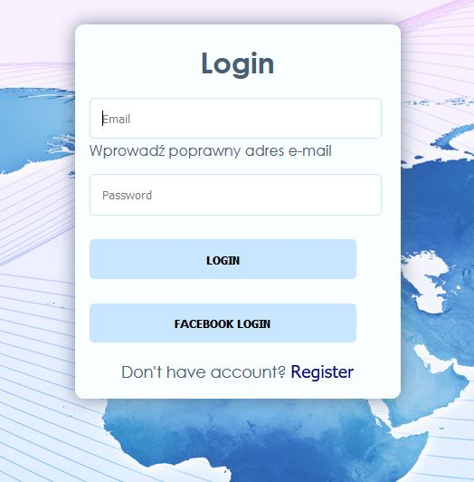
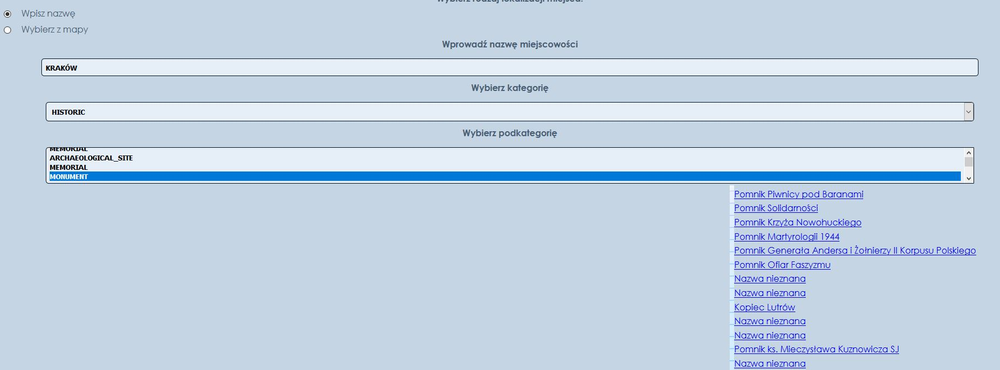
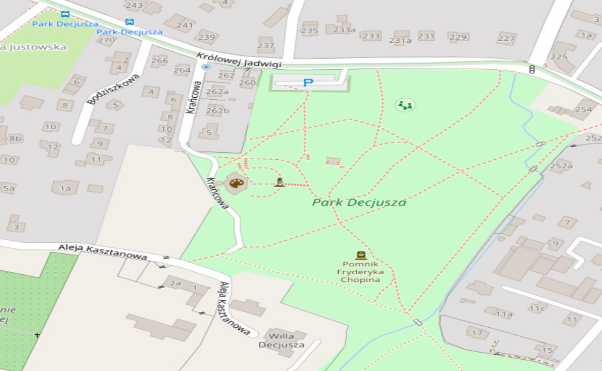

## Charakterystyka projektu
  
Aplikacja o nazwie „Zobacz” ma wyświetlać informację na temat ciekawych miejsc w danej
miejscowości oraz wskazać jakie warunki meteorologiczne aktualnie w niej panują. Aplikacja ma
wyświetlać informację na temat zbytków oraz różnych atrakcji turystycznych w danym rejonie.
Logowanie i rejestracja będzie odbywała się metodą tradycyjną. Możliwe również będzie logowanie
się za pomocą Facebook’a z wykorzystaniem Facebook Javascript sdk.

Interfejs umożliwia wybór miejscowości na kilka sposobów:
a) podanie nazwy miejscowości,
b) wpisanie długości i szerokości geograficznej,

Aplikacja będzie wykorzystywać, w celu wyboru miejscowości, API dostępne na stronie:
[https://overpass-api.de/](https://overpass-api.de/)
Pozyskane dane lokalizacyjne zostaną wykorzystane w API dostępnej na stronie:
[https://openlayers.org/](https://openlayers.org/)
w celu wyświetlenia na mapie wskazanych obiektów.

## Projekt dostępny tutaj

[Link do aplikacji](https://zobacz-9b594.web.app/)  
[Repozytorium na GitHubie](https://github.com/zobaczteam/zobacz)

  
## Skład zespołu projektowego

1. **Piotr Szczepański, 203911, KrZZIs3011Io (kierownik zespołu)**
2. **Jakub Piasecki,    203073, KrZZIs3011Io**
3. **Patryk Materzok,   178301, KrZZIs3011Io**
  
## Cel oraz cechy aplikacji

Celem aplikacji jest pokazanie na mapie ciekawych oraz wartych zobaczenia miejsc na mapie i wyświetlanie
informacji odnośnie danego miejsca lub obiektu.

Poniżej prezentujemy stronę logowania. Można również zalogować się przy użyciu Facebooka

Gdy już jesteśmy zalogowani lub zarejestrowaliśmy się na "zobacz" aplikacji.
Wybieramy metodę wskazania miejsca.
Skupimy się teraz na opcji "Wpisz nazwę"

W kolejny polu, które się pojawia wpisujemy nazwę, później wybieramy kategorię oraz interesujący nas obiekt.

Gdy już wszystko wypełniliśmy naszym oczom ukazuje się mapa w wyśrodkowanym i zaznaczonym obiektem, oraz 
informacja o obiekcie ze strony Wikipedia, razem z odnośnikiem do pełnej treści akrtykułu.

  
## Linki do składowych projektu

#### Prototyp
[Marvel prototyp aplikacji](https://marvelapp.com/c064774)
  
#### Zarządzanie projektem
[Tablica Kanban Jira](https://zobacz.atlassian.net/secure/RapidBoard.jspa?rapidView=1&projectKey=ZOB&atlOrigin=eyJpIjoiZjQwOTk2OWNhMWQ3NDliYmIyMjM5MzIwZDIzZjgxMTEiLCJwIjoiaiJ9)

#### Diagram aplikacji
[Diagram DIA](https://github.com/Stiepek/zobacz/blob/master/DiagramDIA.png)
