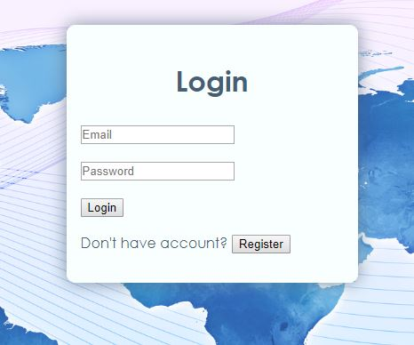

## Charakterystyka projektu
  
Aplikacja o nazwie „Zobacz” ma wyświetlać informację na temat ciekawych miejsc w danej
miejscowości oraz wskazać jakie warunki meteorologiczne aktualnie w niej panują. Aplikacja ma
wyświetlać informację na temat zbytków oraz różnych atrakcji turystycznych w danym rejonie.
Logowanie i rejestracja będzie odbywała się metodą tradycyjną. Możliwe również będzie logowanie
się za pomocą Facebook’a z wykorzystaniem Facebook Javascript sdk.

Interfejs umożliwia wybór miejscowości na kilka sposobów:
a) podanie nazwy miejscowości,
b) wpisanie długości i szerokości geograficznej,

Aplikacja będzie wykorzystywać, w celu wyboru miejscowości, API dostępne na stronie:
[https://places.cit.api.here.com](https://places.cit.api.here.com)
Pozyskane dane lokalizacyjne zostaną wykorzystane w API dostępnej na stronie:
[https://www.openstreetbrowser.org](https://www.openstreetbrowser.org)
w celu wyświetlenia na mapie wskazanych obiektów.

#### Aplikacja mobilna

Aplikacja mobilna będzie posiadała dodatkową funkcjonalność, 
czyli pobranie danych lokalizacyjnych przekazanych przez GPS
a co za tym idzie pokazanie miejsca w którym się znajdujemy 
zamiast wprowadzania jakichkolwiek danych jak miejścowość.
  
## Projekt dostępny tutaj

[Link do aplikacji](https://zobacz-9b594.web.app/)  
[Repozytorium na GitHubie](https://github.com/zobaczteam/zobacz)

#### Aplikacja mobilna

[Repozytorium aplikacji mobilnej]()
  
## Skład zespołu projektowego

1. **Piotr Szczepański, 203911, KrZZIs3011Io (kierownik zespołu)**
2. **Anna Wąsowicz,     161353, KrZZIs3011Io**
3. **Jakub Piasecki,    203073, KrZZIs3011Io**
4. **Patryk Materzok,   178301, KrZZIs3011Io**
  
## Cel oraz cechy aplikacji

  
## Linki do składowych projektu

#### Prototyp
[Marvel prototyp aplikacji](https://marvelapp.com/c064774)
  
#### Zarządzanie projektem
[Tablica Kanban Jira](https://zobacz.atlassian.net/secure/RapidBoard.jspa?rapidView=1&projectKey=ZOB&atlOrigin=eyJpIjoiZjQwOTk2OWNhMWQ3NDliYmIyMjM5MzIwZDIzZjgxMTEiLCJwIjoiaiJ9)

#### Diagram aplikacji
[Diagram DIA](https://github.com/Stiepek/zobacz/blob/master/DiagramDIA.png)
